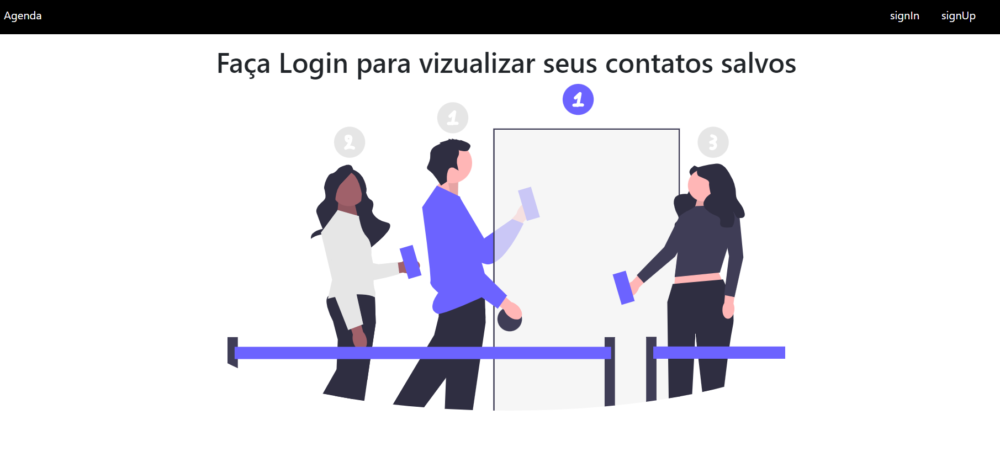

# Projeto Agenda
Projeto feito no curso de JavaScript do professor Luis Otavio, para por em pratica os conhecimentos de Node JS.

## Table of contents

- [Overview](#overview)
  - [The challenge](#the-challenge)
  - [Screenshot](#screenshot)
  - [Links](#links)
- [My process](#my-process)
  - [Built with](#built-with)
  - [What I learned](#what-i-learned)
  - [Useful resources](#useful-resources)
- [Author](#author)

## Overview

### The challenge

Usuarios deverão ser capazes de:

- Cadastrar um Novo Usuario
- Efetuar Login com um Usuario Já cadastrado
- Com o usuario Logado, poder efetuar operações de CRUD em uma lista de contatos.
- Ter uma boa visualização para cada tipo de tela.

### Screenshot

### Links

- Solution URL: [https://github.com/jumaelmartins/Agenda.git](https://github.com/jumaelmartins/Agenda.git)
- Live Site URL: [http://191.234.193.85/](http://191.234.193.85/)

## My process

### Built with

- Semantic HTML5 markup
- CSS custom properties
- Flexbox
- CSS Grid
- JS Vanila
- EJS
- NodeJS
- Webpack
- MongoDb

### What I learned

Com esse projeto foi possivel, compreender como iniciar um servidor com o Node JS criar rotas e se conectar com um banco de dados noSQL. Tambem foi possivel ter uma base de como funciona o modelo MVC.

### Useful resources

- [ChatGPT](https://chat.openai.com/chat) - É uma ferramenta excellente tem me ajudado bastante a tirar duvidas.

## Author

- Portifolio - [Portifolio_JumaelMartins](https://portfolio-jumaelmartins.vercel.app/)
- Linkedin - [@jumael-martins](https://www.linkedin.com/in/jumael-martins/)
- GitHub - [@jumaelmartins](https://github.com/jumaelmartins)
- Frontend Mentor - [@jumaelmartins](https://www.frontendmentor.io/profile/jumaelmartins)

